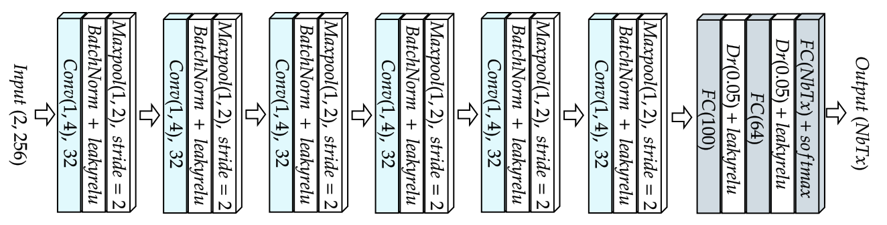
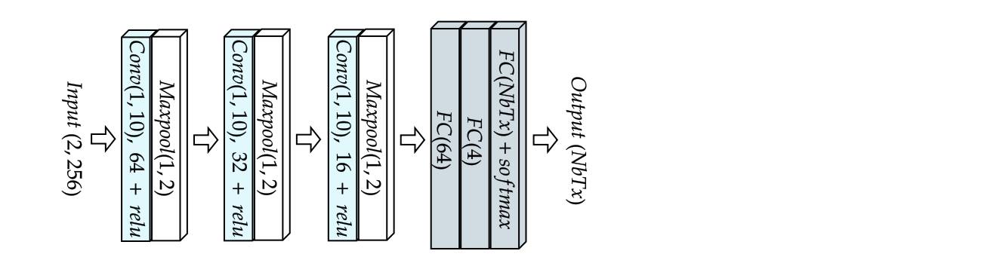

# TITLE 

In this repository are presented the Neural Networks used for the article in Julia. 

## Description

We used the following neural networks :
- [POWDER CNN](https://ieeexplore.ieee.org/document/9348261)

- [Sankhe CNN](https://ieeexplore.ieee.org/document/8882379)

- [Elmaghbub CNN](https://arxiv.org/abs/2308.04467) 

- [Arroyo CNN](https://www.mdpi.com/1424-8220/22/6/2111)

- [WiSig CNN](https://arxiv.org/abs/2112.15363)

- [Feng CNN-GRU](https://ieeexplore.ieee.org/document/9851177) 

- Triple Dense

## Learning rates for each Network-Dataset combination

|                     | **POWDER CNN** | **Sankhe CNN** | **Elmaghbub CNN** | **Arroyo CNN** | **WiSig CNN** | **Feng CNN-GRU** | **Triple Dense** |
|---------------------|----------------|----------------|-------------------|----------------|---------------|------------------|-------------------------|
| **Oracle Dataset**  | ------         | ------         | ------            | ------         | ------        | ------           | ------                  |
| **POWDER Dataset**  | ------         | ------         | ------            | ------         | ------        | ------           | ------                  |
| **WiSig Dataset**   | ------         | ------         | ------            | ------         | ------        | ------           | ------                  |
| **Elmaghbub Dataset**| ------         | ------         | ------            | ------         | ------        | ------           | ------                  |

