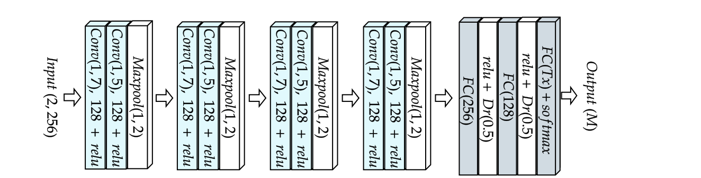
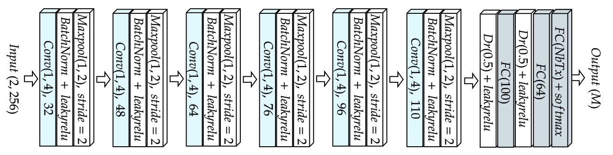
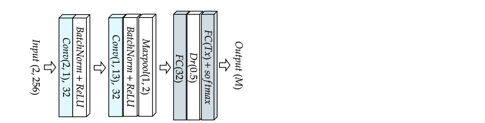

# Lightweight RF Fingerprint Identification: The Revenge of the Fully Connected Neural Networks?
Emma BOTHEREAU∗ , Robin GERZAGUET∗ , Matthieu GAUTIER∗ , Alice CHILLET∗ , Olivier BERDER∗ , 

∗ Univ Rennes, CNRS, IRISA, firstname.name@irisa.fr

In this repository are presented the Neural Networks used for the article in Julia. 

## Description

We used the following neural networks :
- [POWDER CNN](https://ieeexplore.ieee.org/document/9348261)

- [Sankhe CNN](https://ieeexplore.ieee.org/document/8882379)

- [Elmaghbub CNN](https://arxiv.org/abs/2308.04467) 

- [WiSig CNN](https://arxiv.org/abs/2112.15363)

- [Feng CNN-GRU](https://ieeexplore.ieee.org/document/9851177) 

- [Feng CNN](https://ieeexplore.ieee.org/document/10150764)

- FCNN V2

A Flatten layer is required before the Dense layer part of the networks.

## Learning rates for each Network-Dataset combination

All networks undergo 200 epochs of training on the S1 scenario only, with early stopping if the loss function (CrossEntropy) does not decrease for 10 consecutive epochs. We used the Adam Optimizer with the corresponding learning rate. Per default, we used a scheduler, reducing by 10% the learning rate, every 10 epochs.

|                     | **POWDER CNN** | **Sankhe CNN** | **SWRFF CNN**  | **WiSig CNN** | **Feng CNN-GRU** | **Feng CNN** |
|---------------------|----------------|----------------|-------------------|---------------|------------------|-------------------------|
| **POWDER Dataset**   | 0.0001         | 0.0001         | 0.0001           | 0.0001        | 0.0005*           |   0.001                | 
| **Wisig Dataset - 6Tx**  | 0.0001         | 0.00001         | 0.0001                  | 0.0001        | 0.0001           |  0.001                   |
| **Wisig Dataset - 90Tx**  | 0.0001           | 0.001           |   0.01                | 0.001        | 0.001              | 0.001   |
| **SWRFF Dataset**| 0.0001         | 0.0001         | 0.0001               | 0.001        | 0.005*          |  0.001                 |
| **Oracle Dataset**  | 0.0001       | 0.0001         | 0.0001           | 0.001        | 0.001           | 0.0001                   |

*The scheduler reduce by 10% the learning rate, every 30 epochs, early stopping if loss did not reduced for 30 epochs

